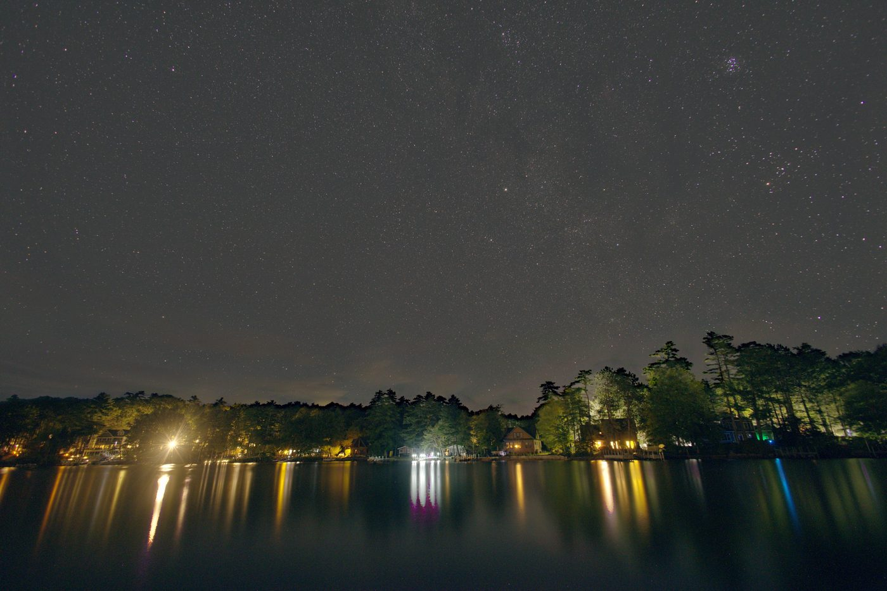
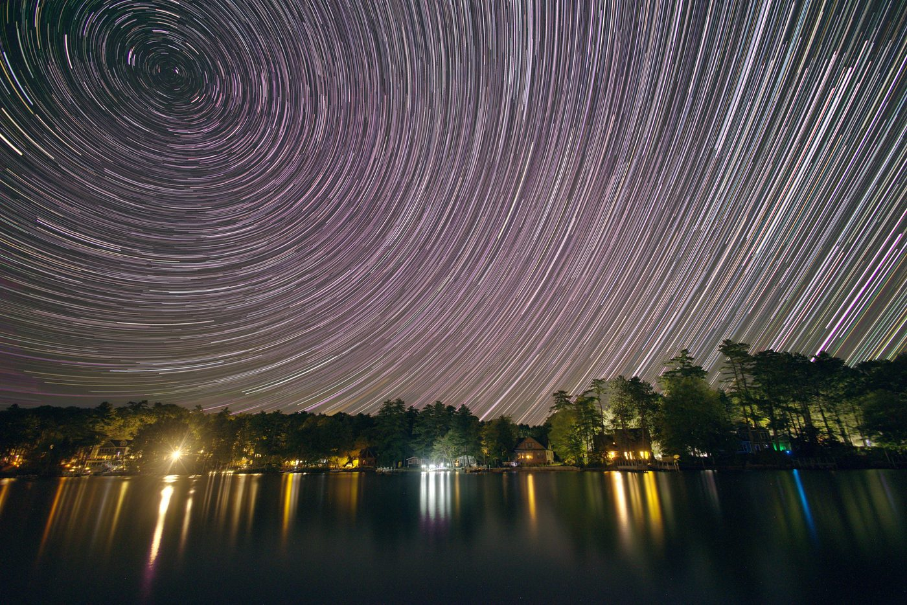

# AzimuthAstro

CLI tools for untracked wide-field nightscape sequences: one set of frames in, and out come a
crisp stacked sky over a frozen ground, gapless and comet star trails, three timelapses,
a plate-solved annotation, a traffic map of every plane and satellite, a cirrus mood composite
and a print-ready flattened version.

The model behind it: only the stars rotate. The ground, the light-pollution glow and the lens
vignetting are fixed to the camera. Frames are blanked (ground, clouds, hot pixels = 0, which
Siril treats as no-data), registered with a physical prior (the pole position plus the sidereal
rate from the EXIF timestamps, refined with a fitted residual lens distortion), stacked, and
composited as stationary background + aligned star layer inside a pixel-accurate sky mask.




## Requirements

Windows, Python 3.12 with numpy, scipy, astropy, opencv-python, tifffile, pillow, lensfunpy, rawpy,
torch (CUDA build, optional but 5-10x faster for trails and timelapses). ASTAP with a star database,
exiftool, ffmpeg. No Siril: LibRaw decodes the raws (`decode.py`) and `stack.py` does the rejection
stacking in row bands, so a night of any length fits in memory.

## Use

```bash
python azastro.py process D:/AstroWork/mysky NightName "D:/Pictures/.../lights"   # the whole night, one command
python azastro.py inspect "D:/Pictures/.../lights"      # settings drift, cadence, test frames, fog, cloud dips
python azastro.py new D:/AstroWork/mysky NightName "D:/Pictures/.../lights" --auto
python azastro.py run D:/AstroWork/mysky                 # every stage; --from/--to to resume or stop early
python azastro.py status D:/AstroWork/mysky            # current run: stages, gates, last progress line
python azastro.py wait D:/AstroWork/mysky --stage tone   # block until a stage (or the run) ends; prints only what is new
python azastro.py report D:/AstroWork/mysky              # the numbers that decide a night + one contact sheet
python azastro.py stop D:/AstroWork/mysky
```

`pip install -e .` puts an `azastro` command on the path (editable install: the stages are scripts
that live beside the CLI).

`inspect` reads only EXIF and the embedded previews (no raw decode), so it takes a few minutes for
600 frames and needs nothing but exiftool. It flags what has bitten before: autofocus left on,
CRAW, mechanical or full-electronic shutter, ISO below 640, LENR, a poor duty cycle, and it
finds the test frames (irregular timing) and where fog took the star count down. It also finds
the celestial pole: between two previews the sky has turned by an angle the clock gives, and on a
wide lens that motion is the pinhole homography K·R·K⁻¹ (`optics.py`, the one model registration
uses too), not a rigid rotation, so the only unknown is the pole's image point; matched star peaks
score every candidate axis on the sphere and the best is refined over a 15-minute baseline. `new
--auto` uses the frame selection, pole and sky row directly.

`newproject.py` takes the CR3 folder and the 1-based first/last positions to use (drop test frames
and fog), reads exposure, timestamps, orientation, white balance, lens, focal length and crop
factor from EXIF, and writes `project.json`. `--pole` overrides the celestial pole (display pixels);
`--skyrows` a display row above which everything is certainly sky.

Stages, in order: convert (LibRaw debayer to sensor ADU, rotated to display orientation) → hot (hot-pixel patch) → ground
(median and sigma-clipped static stacks) → mask → refine (pixel-accurate treeline) → clouds →
register (stars from the decoded frames, positions lens-corrected, never the images) → fit → warp
(one resampling per frame onto the padded canvas, on the GPU) → stack → tone → astap → annotate →
traffic → mood → print → trails → export → timelapse → encode → deliver. A frame is read once and
warped once; nothing between decode and the stack is written but the warped frames. Each writes
`log_<stage>.log`; `chain.log` shows progress. Outputs land in the project directory as
`<name>_*.jpg/.tif/.mp4` and are copied next to the source folder by `deliver`.

The work directory must sit on a drive that writes fast: a night writes about 40 GB of decoded frames
and 50 GB of warped float16 frames, and nothing else in the chain costs as much as a slow write (a
drive writing at 35 MB/s turned a 15-minute warp into an hour).

## Checks that run by themselves

`gates.py` runs after each stage and fails the run when a check fails; each check is a bug that
happened once (upside-down rotation, hot-pixel threshold misfire, mask leaking into the lake, stars
erased by the composite, empty trail layer). `python smoke.py` builds a 12-frame synthetic session
with a known pole, treeline, lamp, cloud and hot pixels and runs the chain through the composite in
about 90 seconds; run it before trusting any change. `azastro run` skips stages that already have a
done marker (`--force` to redo, `--detach` to survive the terminal) and refuses to start while
another chain holds the project (`chain.pid`): two chains writing the same frames once left a
session half-patched.

## Read before changing anything

`docs/` is not written yet; the reasoning that produced each stage lives in the module docstrings.
The things that bit hardest: Siril's own registration cannot handle a 16 mm field beyond ±5°
(and its convert rewrote every rotated frame, 48 minutes a night, which is why LibRaw replaced it);
zero pixels are no-data to the rejection stacking; the aligned stack smears the horizon glow
so the composite background must come from the static stack near the treeline; scipy's
`binary_erosion(iterations=0)` erodes until nothing is left; FITS rows are stored bottom-up,
which reverses `np.rot90`; on a 16 mm lens the sky does not turn rigidly in the frame (a pole
40° off-axis moves stars 10-20% differently across the field), so any rigid-rotation fit fails. Every threshold on brightness or texture must be relative to the frame's own measured noise
and drift: an absolute 2 ADU texture test and a 1.5 ADU cloud test, both tuned on one night's CRAW
frames, cut the next night's mask straight across and flagged 60% of its clear sky as cloud. And image
statistics (the tone black point) are taken inside the data footprint, never over the empty wedges the
fitted distortion leaves at the edges.

## Credits

`sky_data/` holds the star, constellation and deep-sky catalogues of [d3-celestial](https://github.com/ofrohn/d3-celestial) (BSD-3), used for the annotated frame. `lensfun-mil-canon.xml` is an extract of the [lensfun](https://lensfun.github.io/) database (CC BY-SA 3.0), edited to database version 1 for lensfunpy.
